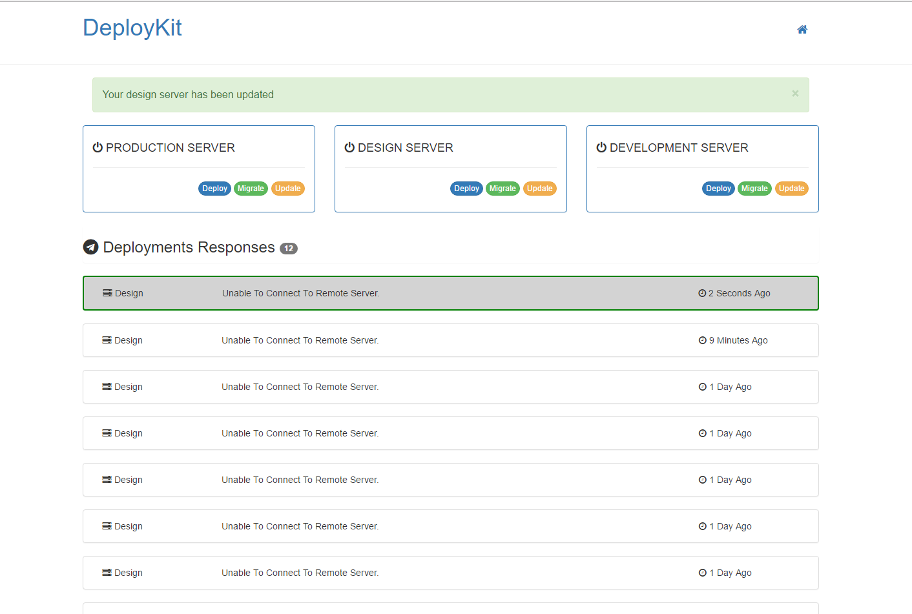

# Deploykit

[![Latest Version on Packagist][ico-version]][link-packagist]
[![Software License][ico-license]](LICENSE.md)
[![Build Status][ico-travis]][link-travis]
[![Total Downloads][ico-downloads]][link-downloads]

### Screenshot



This is where your description should go. Try and limit it to a paragraph or two, and maybe throw in a mention of what PSRs you support to avoid any confusion with users and contributors.

## Install

Via Composer

``` bash
$ composer require shawnsandy/deploykit
```

## Usage
--------------

#### Quick Start

__Install the service provider__

Add the DeploykitServiceProvider to the `config/app.php`

``` php

'providers' => [
/*
* Package Service Providers...
*/

//...

ShawnSandy\Deploykit\DeploykitServicesProvider::class,
Collective\Remote\RemoteServiceProvider::class,

//...

]

```

Next add the Facade to you `config.php`

``` php
 'aliases' => [
    // ...
      'SSH' => Collective\Remote\RemoteFacade::class,
    // ...
  ],

  ```


__Publish vendor/packages assets__


You can publish vendor files individually using `--tag` option or all using `--provider`

__Assets__

``` bash

php artisan vendor:publish --tag=deploykit-assets

```

__Views__

``` bash

php artisan vendor:publish --tag=deploykit-views

```

__Config__

``` bash

php artisan vendor:publish --tag=deploykit-config

```

__Provider__ 

Publishes all vendor files

``` bash

php artisan vendor:publish --provider="ShawnSandy\Deploykit\DeploykitServicesProvider"

```

__Add the dollowing lines to your `routes\web.php`__

``` php

    Route::group(['prefix' => 'deploy', 'middleware' => 'auth'], function (){

        Route::resource('/', '\ShawnSandy\Deploykit\Controllers\DeployKitController');
        Route::get('/connection/{connection}', '\ShawnSandy\Deploykit\Controllers\DeployController');

    });

```

### Config options 

``` php 

return [

    'commands' => [

        "default" => ['cd /var/www', 'git pull', 'php artisan cache:clear'],

        "migrate" => ['cd /var/www', 'git pull', 'php artisan migrate', 'php artisan cache:clear'],

        "update" => ['cd /var/www', 'git pull', 'composer update', 'php artisan migrate', 'php artisan cache:clear'],

    ],

    'limit_responses' => 200,

    'responses_per_page' => 20,


];

```


### Advanced Usage 

Soon

## Change log

Please see [CHANGELOG](CHANGELOG.md) for more information what has changed recently.

## Testing

``` bash
$ composer test
```

## Contributing

Please see [CONTRIBUTING](CONTRIBUTING.md) and [CONDUCT](CONDUCT.md) for details.

## Security

If you discover any security related issues, please email shawnsandy04@gmail.com instead of using the issue tracker.

## Credits

- [Shawn Sandy][link-author]
- [All Contributors][link-contributors]

## License

The MIT License (MIT). Please see [License File](LICENSE.md) for more information.

[ico-version]: https://img.shields.io/packagist/v/shawnsandy/deploykit.svg?style=flat-square
[ico-license]: https://img.shields.io/badge/license-MIT-brightgreen.svg?style=flat-square
[ico-travis]: https://img.shields.io/travis/shawnsandy/deploykit/master.svg?style=flat-square
[ico-scrutinizer]: https://img.shields.io/scrutinizer/coverage/g/shawnsandy/deploykit.svg?style=flat-square
[ico-code-quality]: https://img.shields.io/scrutinizer/g/shawnsandy/deploykit.svg?style=flat-square
[ico-downloads]: https://img.shields.io/packagist/dt/shawnsandy/deploykit.svg?style=flat-square

[link-packagist]: https://packagist.org/packages/shawnsandy/deploykit
[link-travis]: https://travis-ci.org/shawnsandy/deploykit
[link-scrutinizer]: https://scrutinizer-ci.com/g/shawnsandy/deploykit/code-structure
[link-code-quality]: https://scrutinizer-ci.com/g/shawnsandy/deploykit
[link-downloads]: https://packagist.org/packages/shawnsandy/deploykit
[link-author]: https://github.com/shawnsandy

